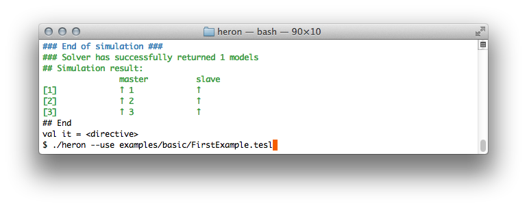

Heron [](https://travis-ci.org/heron-solver/heron) [](https://github.com/EmptyStackExn/heron/releases/latest)
===================



**Heron** [1, 2] is a solver for the [Tagged Events Specification Language (TESL)](http://wdi.supelec.fr/software/TESL/), a declarative language for specifying synchronization of discrete events for simulation [3]. This prototype provides:

 1. Definition of TESL specifications for causality and time scale between events.
 2. Simulation by [sound and complete](https://github.com/heron-solver/hygge) generation of execution traces.
 3. Scenario testing.


Getting started
-------------------

### Binary distribution
The easiest way to start with Heron is to get the [latest binary release](https://github.com/EmptyStackExn/heron/releases/latest) (Linux and macOS systems). To solve an example, you can simply type
```bash
./heron --use examples/basic/FirstExample.tesl
```

### Examples
 - [Airbus A320 Autobrake System](examples/aviation/A320-Autobrake.tesl)
 - [Airbus A320 Acceleration-Stop Distance](examples/aviation/A320-AccelerationStop.tesl)
 - [Zeno Effect with Hyperbolic Tangent](examples/ZenoEffect.tesl)
 - [Distance Calculation with Time-Varying Integrals](examples/aviation/SpeedIntegral.tesl)

For more information, please refer to the [Heron Reference Manual](doc/README.md).

References
-------------------

 1. [Formalizing Time and Causality in Polychronous Polytimed Models](https://tel.archives-ouvertes.fr/tel-01892649/document) (Doctoral Thesis), Hai Nguyen Van, 2018
 2. [A Symbolic Operational Semantics for TESL with an Application to Heterogeneous System Testing](https://hal-centralesupelec.archives-ouvertes.fr/hal-01583815v1), Formal Modeling and Analysis of Timed Systems (FORMATS), 14th International Conference, Berlin, Germany, Sept 5-7, 2017
 3. [TESL: a Language for Reconciling Heterogeneous Execution Traces](https://tel.archives-ouvertes.fr/SUP_E3S/hal-01100179v1), Formal Methods and Models for Codesign (MEMOCODE), 2014 Twelfth ACM/IEEE International Conference on, Lausanne, Switzerland, Oct, 2014, 114-123

People
-------------------

The project is named after [Heron of Alexandria](http://www-history.mcs.st-andrews.ac.uk/Biographies/Heron.html), the first-century Greek mathematician and engineer. It proudly uses [MLton](http://mlton.org) as its Standard ML compiler. Made with love by Hai Nguyen Van, Thibaut Balabonski, Frédéric Boulanger, Chantal Keller, Benoît Valiron, Burkhart Wolff.

License
-------------------

Heron is released under the MIT License.

THE PROVIDER MAKES NO REPRESENTATIONS ABOUT THE SUITABILITY, USE, OR PERFORMANCE OF THIS SOFTWARE OR ABOUT ANY CONTENT OR INFORMATION MADE ACCESSIBLE BY THE SOFTWARE, FOR ANY PURPOSE. THE SOFTWARE IS PROVIDED "AS IS," WITHOUT EXPRESS OR IMPLIED WARRANTIES INCLUDING, BUT NOT LIMITED TO, ANY IMPLIED WARRANTIES OF MERCHANTABILITY, FITNESS FOR A PARTICULAR PURPOSE, OR NONINFRINGEMENT WITH RESPECT TO THE SOFTWARE. THE PROVIDER IS NOT OBLIGATED TO SUPPORT OR ISSUE UPDATES TO THE SOFTWARE.
