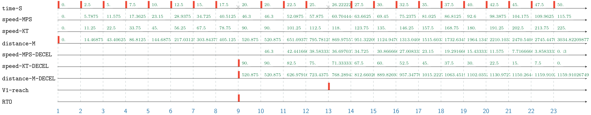

Airbus A320 Acceleration-Stop Distance
===================
> :wrench: Try me with the latest version of [](https://github.com/EmptyStackExn/heron/releases/latest)
> ```
> ./heron --use examples/aviation/A320-AccelerationStop.tesl
> ```

This specification describes an acceleration-stop scenario of the transport-category aircraft Airbus A320. It depicts how the language also allows to express physical time and quantities with differential equations.

From the [A318/A319/A320/A321 Performance Training Manual](A320-RTOW-PARIS-ORLY-RWY08.jpg):

 - Paris Orly (ORY/LFPO)
 - T/O RWY 08
 - DRY conditions
 - TAILWIND -10 kt
 - WEIGHT 55.8 tons
 - Flaps 1 (CONF 1+F)
 - Maximum takeoff thrust
 - Decision speed: V1 = 118 kt
 - Acceleration-Stop Distance Available (ASDA): 1500 m

In the following specification, we declare clocks: time in s, speed in m.s⁻¹, speed in kt, and distance in m. Likewise, we declare additional quantity-clocks for the deceleration stage. Note that a clock is a quantity where tags are **monotone**. We def
```
rational-clock time-S              // in [s]
rational-clock speed-MPS           // in [m.s⁻¹]
rational-clock speed-KT            // in [kt]
rational-quantity distance-M       // in [m]
rational-quantity speed-MPS-DECEL
rational-quantity speed-KT-DECEL
rational-quantity distance-M-DECEL

// Unit conversion between [kt] and [m.s⁻¹]
tag relation speed-KT       = <3600/1852> * speed-MPS
tag relation speed-KT-DECEL = <3600/1852> * speed-MPS-DECEL

// V1 threshold
V1-reach sporadic 118.0 on speed-KT
```

First, we define how speed is gained by uniform acceleration of 4.5 kt/s with an affine tag relation. Then, to compute the run distance of the moving object in general, we express distance `x` as a differential equation with respect to time `t` and speed `v`: `dx = v.dt`. These quantities correspond to the clocks `distance-M`, `time-S` and `speed-MPS`.
```
// 1. Uniform acceleration of 4.5 kt/s
tag relation speed-KT = 4.5 * time-S

// Compute run distance with time-variant integration: dx = v.dt
tag relation (der distance-M) = speed-MPS * (der time-S)
```

The second part of the specification describes the decelerating process similarly as above. Acceleration or deceleration can be expressed by affine tag relations, or also again differential equations. To illustrate this, we define that deceleration rate is -3.0 kt/s with the differential equation `dv' = -3.0.dt`:
```
// 2. Uniform deceleration of -3 kt/s with ODE dv' = -3.0.dt
tag relation (der speed-KT-DECEL) = -3.0 * (der time-S)

// Again, compute run distance when decelerating: dx' = v'.dt
tag relation (der distance-M-DECEL) = speed-MPS-DECEL * (der time-S)
```

Finally, we define our scenario and how the solver unrolls the execution of the specification. We chose to reject takeoff at 20 s and defined a simulation step of 2.5 s:
```
RTO sporadic 20.0 on time-S                      // Reject takeoff at 20 s
time-S periodic 2.5                              // Simulation step
						        
@policy asap                                     // Execute ASAP
@scenario 1 (distance-M -> 0.0)                  // Initial condition of ODE
@run until RTO                                   // Acceleration until RTO
@scenario next (distance-M-DECEL -> distance-M)  // Sync distances
@scenario next (speed-KT-DECEL -> speed-KT)      // Sync speeds
@maxstep 23					        
@run                                             // Deceleration
```

Simulation
----------

<p align="center">
  
</p>

The execution trace starts with time, distance and speed all set to 0.0. Acceleration occurs until takeoff rejection (clock `RTO`), where speed and distance are synced with their corresponding clocks for the deceleration part. Finally, the moving object decelerates until approximately 1159 m (as shown on `distance-M-DECEL` at 23rd instant). Note that distance value is accurate with respect to the simulation step size which is here set to 2.5 s: a lower value yields a more accurate computation but slowers the solver.
