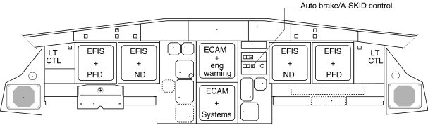
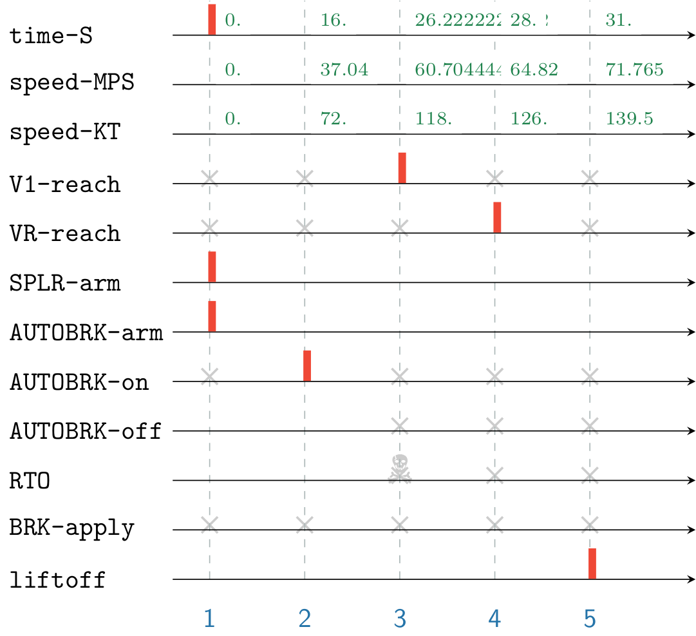
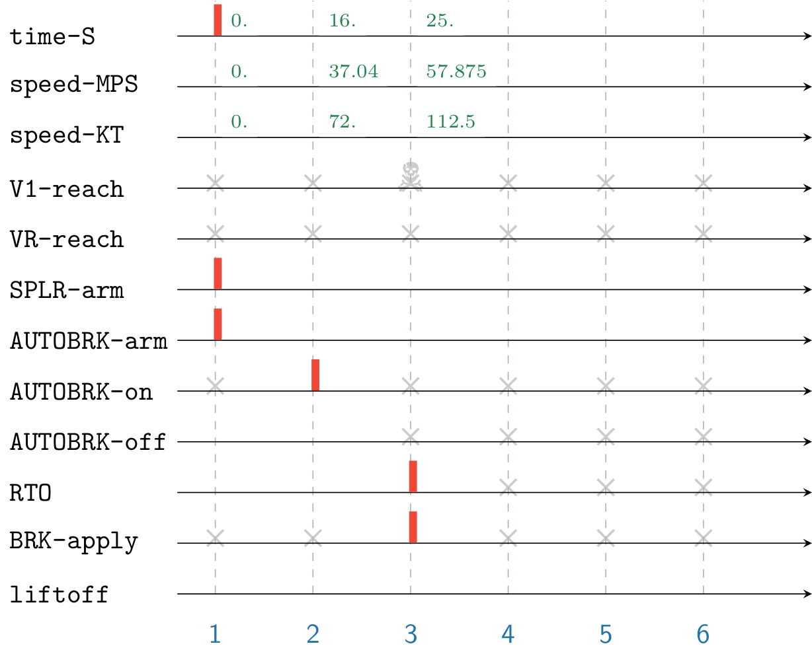

Airbus A320 Autobrake System
===================
> :wrench: Try me with the latest version of [](https://github.com/EmptyStackExn/heron/releases/latest)
> ```
> ./heron --use examples/aviation/A320-Autobrake.tesl
> ```



The following specification describes a takeoff scenario of the transport-category aircraft Airbus A320. The default scenario describes a normal takeoff with no engine failure. It illustrates the purpose of mixing event-driven and time-driven behaviors with some asynchronous extensions. In this study case, we describe at high-level the behavior of the [autobrake system](https://pdfs.semanticscholar.org/7095/958b414fb0e01a552abdc351f70272457909.pdf) as specified in the A320 Flight Crew Operating Manual.

From the [A318/A319/A320/A321 Performance Training Manual](A320-RTOW-PARIS-ORLY-RWY08.jpg):

 - Paris Orly (ORY/LFPO)
 - T/O RWY 08
 - DRY conditions
 - TAILWIND -10 kt
 - WEIGHT 55.8 tons
 - Flaps 1 (CONF 1+F)
 - Maximum takeoff thrust

Performance speeds (IAS):
 - Decision speed: V1 = 118 kt
 - Rotate speed: VR = 126 kt

First, we express three clocks `time-S`, `speed-MPS` and `speed-KT` which denote physical time and quantities for the case study. A tag relation is described to define unit conversions between m.s⁻¹ and kt, and uniform acceleration is defined by 4.5 kt/s. Reaching V1 and VR speeds will triggers their corresponding clocks `V1-reach` and `VR-reach`. These clocks serve as a discrete observation of the continuous system. Lastly, aircraft lift off occurs 3 s after reaching VR speed.
```
rational-clock time-S     // in [s]
rational-clock speed-MPS  // in [m.s^-1]
rational-clock speed-KT   // in [kt]

// Unit conversion between [kt] and [m.s^-1]
tag relation speed-KT = <3600/1852> * speed-MPS

// Uniform acceleration of 4.5 kt/s
tag relation speed-KT = 4.5 * time-S

// Speed thresholds
V1-reach strictly precedes VR-reach
V1-reach sporadic 118.0 on speed-KT
VR-reach sporadic 126.0 on speed-KT

// Liftoff occurs 3s after reaching VR
VR-reach time delayed by 3. on time-S implies liftoff
```

Autobrake activates whenever it was previously armed along with ground spoilers, and airspeed has exceeded 72 kt. We define a race condition between brake application and reaching V1 speed: should takeoff be rejected (clock `RTO`), brakes will be applied `BRK-apply` and V1 will not be reached in the future; otherwise, reaching V1 prevents from rejecting takeoff.
```
// Autobrake
SPLR-arm strictly precedes AUTOBRK-on
AUTOBRK-arm strictly precedes AUTOBRK-on
AUTOBRK-on sporadic 72.0 on speed-KT

// In the event of takeoff rejection (RTO), the system applies brakes
// as long as autobrakes were in active state
RTO sustained from AUTOBRK-on to AUTOBRK-off implies BRK-apply

// RTO is forbidden after reaching V1
// Conversely, applying brakes prevents from reaching takeoff speeds
V1-reach kills RTO
BRK-apply kills V1-reach
```

Go Situation
----------

<p align="center">
  
</p>

In the first simulation, takeoff occurs normally. In the first instant, ground spoilers and autobrake were armed. Acceleration begins. At 72 kt, autobrake becomes ready. Decision of whether continuing or aborting takeoff by the pilot-in-command occurs before the speed limit V1 = 118 kt. Then the aircraft rotates on its main wheels at VR = 126 kt, and is airborne 3 s after (clock `liftoff`).

No Go Situation
----------

<p align="center">
  
</p>

An alternative satisfying run is possible when adding `RTO sporadic 25. on time-S` to the specification, which specifies to reject takeoff at 25 s. For instance, this may happen when warnings or dangerous situations are observed by the pilot-in-command. In this case, it is not possible to reach V1, VR and hence aircraft will not lift off.
