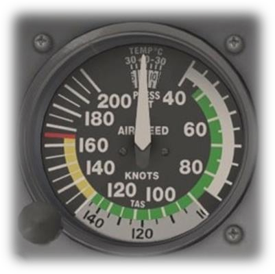
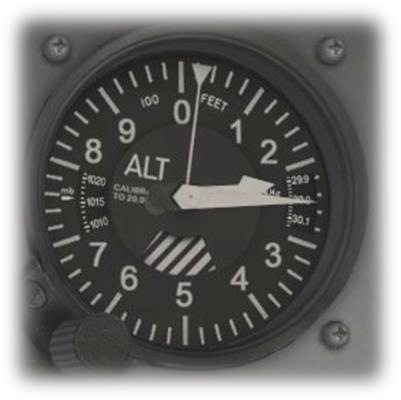
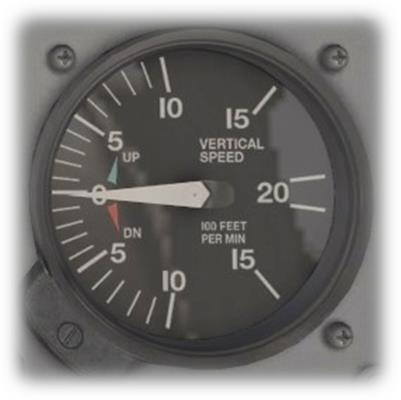

Cessna C172 Takeoff
===================
> :wrench: Try me with the latest version of [](https://github.com/EmptyStackExn/heron/releases/latest)
> ```
> ./heron --use examples/aviation/C172-Takeoff.tesl
> ```

<p align="center">
  
  
  
</p>

This specification illustrates the TESL language with a simple takeoff scenario. It depicts the computation of quantities and units for time, speed and altitude. Performance speeds (IAS) of the Cessna 172 are determined for a takeoff at Perpignan-Rivesaltes Airport (PGF/LFMP) with altitude set on local QNH:
 - VR = 55 kt
 - Vy = 74 kt (corresponds to 1200 ft/min in vertical speed)

The TESL language allows to define arithmetic relations between clock timeframes. These are called tag relations and allow to describe unit conversions:
```
// Unit conversion between [s] and [min]
tag relation time-S = 60. * time-MIN
// ... and between [kt] and [m.s^-1]
tag relation speed-KT = <3600/1852> * speed-MPS
```

They can also be used to describe a uniform acceleration for the aircraft of 4.5 kt/s by means of an affine relation between `speed-KT` and `time-S`:
```
tag relation speed-KT = 4.5 * time-S
```

The language also allows to describe event-driven and time-driven behaviors. The `sporadic` atom specifies that an event on `VR-reach` will occur when `55.0` is reached on `speed-KT` clock timeframe. Also, synchronous `implies` enforces that if `VR-reach` is triggered, so will `liftoff` instantaneously. In other words, the aircraft lifts off whenever airspeed reaches VR = 55 kt.
```
// Liftoff occurs instantaneously at rotation speed VR = 55 kt
VR-reach sporadic 55.0 on speed-KT
VR-reach implies liftoff
```

To achieve best performance, the pilot-in-command controls climb rate by aiming its target airspeed to Vy. To keep this model simple, we assume in a general physical model that this corresponds to a vertical speed of 1200 ft/min. Again, tag relations serve our purpose:
```
// Controling Vy in IAS ensures vertical speed of 1200 ft/min approx.
// -100 is to arbitrarily set the altimeter with local QNH on 144 ft AMSL
tag relation altitude-FT = 1200.0 * time-MIN + -100.0
```

Finally, takeoff phase ends when the minimum safe altitude (MSA) is reached, i.e., 300 ft above ground. The `time delayed` implication specifies that if `liftoff` occurs, then the event `MSA-reach` will also occur at the instantaneous measured value on `altitude-FT` delayed by `300.0`.
```
liftoff time delayed by 300. on altitude-FT implies MSA-reach
```

Simulation
----------

<p align="center">
  
</p>

This execution trace depicts a satisfying run starting when time is 0 s. During acceleration at 12 s, speed has reached VR = 55 kt. Consequently, clock `VR-reach` is triggered and hence `liftoff`. At that point, ground height is still 0 ft but QNH altitude is 144 ft (as the runway is 144 ft above mean sea level). The aircraft finally reaches the lowest safe altitude at 444 ft AMSL.
